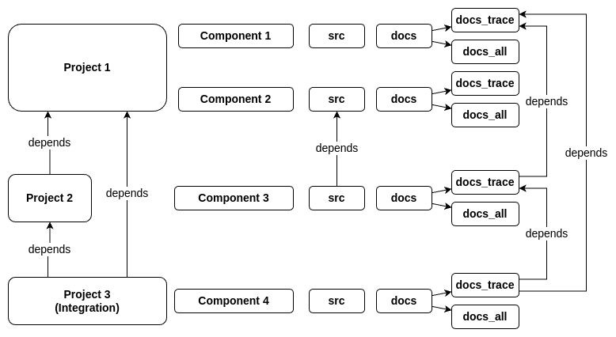

Let Bazel drive Sphinx
======================

This project demonstrates how to use Bazel to collect reStructuredText (RST) files from various components
and generate a Sphinx documentation project with multi-project support and cross-project traceability.

That enables modular requirement tracing with `Sphinx-Needs <https://sphinx-needs.readthedocs.io>`__ in
large scale build setups in which Bazel decides about the inclusion or exclusion of components to the overall build.
Bazel effectively replaces the build system part of Sphinx.

Goals

- Sphinx is used to generate the documentation from the collected RST files
- Sphinx-Needs is used and works in the setup with cross-project traceability.
- Bazel decides which single RSTs or groups of RSTs to build across multiple projects (feature flags become possible).
- Bazel ``build`` targets are used for isolation (instead of ``run`` targets)
- Cross-project needs.json passed using Bazel rules, not via remote URLs, so everything can be built by Bazel locally.
- Cross-project dependencies using needs.json are managed by Bazel. Multi-step integration projects become possible.
  Need imports are automatically generated as ``.. needimport::`` directives in separate files.
- Bazel caches cross-project needs.json files.
- The original Sphinx structure is preserved: project root ``index.rst`` files use ``*/docs/index`` glob patterns 
  to auto-include generated needimport directives from the ``needimports/docs/`` subdirectory.
  No modifications of user provided ``.. toctree::`` directives.
- Sphinx will run the build and safely complain if there are missing files or references.
- The new schema validation feature of Sphinx-Needs is used to ensure that the documentation schema is valid.
- Auto-generate per-project Bazel goals for the ``html``, ``needs`` and ``schema`` builders.
- The original file structure of RSTs is kept, so that the docname variable is not affected.
  This is helpful when needs schema validation is done based on the contained folder structure.

The solution assumes a safe subset of Sphinx/Sphinx-Needs features are used (to be documented).
E.g. linking to a headline in a Bazel excluded file will naturally fail or linking to a need that is not included.
But these are all expected failures and Sphinx should be called with ``-W`` to fail on any warnings.

Target Dictionary System
------------------------

The system uses a **targets dictionary** in each project's ``BUILD.bazel`` file to define different groups of file targets that can be built independently. Each dictionary maps group names to lists of Bazel labels:

.. code-block:: starlark

   targets = {
       "all": [
           "//projects/webapp/api/docs:docs_all",
           "//projects/webapp/auth/docs:docs_all", 
           "//projects/webapp/schema_fail/docs:docs_all",
       ],
       "trace": [
           "//projects/webapp/api/docs:docs_trace",
           "//projects/webapp/auth/docs:docs_trace",
           "//projects/webapp/schema_fail/docs:docs_trace", 
       ],
   }

**Automatic Target Generation:**

The ``generate_sphinx_docs()`` function automatically creates **6 build targets** from each targets dictionary:

For each group key (e.g., ``"all"``, ``"trace"``), it generates:

1. ``docs_html_{group}`` - HTML documentation generation
2. ``docs_needs_{group}`` - needs.json file generation  
3. ``docs_schema_{group}`` - schema validation only

So a dictionary with 2 groups creates 6 total targets:
- ``docs_html_all``, ``docs_html_trace``
- ``docs_needs_all``, ``docs_needs_trace`` 
- ``docs_schema_all``, ``docs_schema_trace``

The names ``all`` and ``trace`` are used to distinguish between full documentation builds and trace-only artifacts.
This enables fast traceability validation and reports.
Projects can decide which target keys to introduce in their targets dictionary, ``all`` and ``trace`` are just
examples. A project could also be split into multiple components and file groups can be selected independently
using ``config_setting``. Just make sure the toctree glob structure supports the exclusion of filers/folders.

Behind the scenes
-----------------

Sphinx itself is a build system. It has some mechanism for the inclusion and exclusion of files, but the logic
is maintained in the Python file ``conf.py`` which does not integrate well with build systems.
Sphinx also requires all files to be part of the build root, which is not always the case in large projects.

The idea of this demo is to delegate the dependency management inside a Sphinx project to Bazel.
That includes the collection of RST files and other assets from different components,
which are organized in a Bazel workspace or Bazel module.
That way documentation and requirements can be selected the same way features are selected for code
components.
In this approach Bazel can also pass on tags to the Sphinx ``sphinx-build`` CLI which can be used for
variant management or other dynamic behavior in Sphinx-Needs.

The original file/folder structure of the docs sources is kept,
as authors still want to maintain a documentation structure and also because RST docnames might be examined by Sphinx extensions.

   
   Architecture overview of the Bazel-driven Sphinx documentation system for example projects and components.

Getting Started
---------------

To get started with this project, ensure you have `Bazelisk <https://github.com/bazelbuild/bazelisk>`__ installed.
It will get the correct version of Bazel. It also install a symlink ``bazel`` to the ``bazelisk`` binary which
can be used as a drop-in replacement for ``bazel``.

You can then build the documentation by running the appropriate Bazel commands.

Project Structure
-----------------

The project is organized to demonstrate modular documentation management with Bazel across multiple projects::

  bazel-drives-sphinx/
  ├── MODULE.bazel                    # Bazel module configuration
  ├── BUILD.bazel                     # Root build file
  ├── README.rst                      # This file
  ├── cfg_bazel/                      # Bazel config
  │   ├── BUILD.bazel                 # Make it a package
  │   └── config.bzl                  # Bazel rules for Sphinx target generation
  ├── projects/                       # Multi-project structure
  │   ├── acdc/                       # ACDC project (AC/DC components)
  │   │   ├── BUILD.bazel             # Project build configuration (targets dictionary)
  │   │   ├── conf.py                 # Sphinx configuration
  │   │   ├── index.rst               # Project root with */docs/index glob pattern
  │   │   ├── schemas.json            # Project-specific schema definitions
  │   │   ├── ubproject.toml          # Sphinx-Needs project configuration
  │   │   ├── ac/                     # AC component
  │   │   │   └── docs/               # AC documentation
  │   │   │       ├── BUILD.bazel     # Component docs filegroups
  │   │   │       ├── index.rst       # Component entry point
  │   │   │       └── lots_of_ac.rst
  │   │   └── dc/                     # DC component
  │   │       └── docs/               # DC documentation
  │   │           ├── BUILD.bazel     # Component docs filegroups
  │   │           ├── index.rst       # Component entry point
  │   │           └── lots_of_dc.rst
  │   ├── webapp/                     # Web application project
  │   │   ├── BUILD.bazel             # Project build configuration (targets dictionary)
  │   │   ├── conf.py                 # Sphinx configuration
  │   │   ├── index.rst               # Project root with */docs/index glob pattern
  │   │   ├── schemas.json            # Project-specific schema definitions
  │   │   ├── ubproject.toml          # Sphinx-Needs project configuration
  │   │   ├── api/                    # API component
  │   │   │   └── docs/               # API documentation
  │   │   │       ├── BUILD.bazel     # Component docs filegroups
  │   │   │       ├── index.rst       # Component entry point
  │   │   │       ├── responses.rst
  │   │   │       └── endpoints/
  │   │   │           └── index.rst
  │   │   ├── auth/                   # Authentication component
  │   │   │   └── docs/               # Auth documentation
  │   │   │       ├── BUILD.bazel     # Component docs filegroups
  │   │   │       ├── index.rst       # Component entry point
  │   │   │       ├── intro.rst
  │   │   │       └── trace/          # Traceability artifacts
  │   │   │           ├── authentication.rst
  │   │   │           └── authorization.rst
  │   │   └── schema_fail/            # Example with validation errors
  │   │       └── docs/
  │   │           ├── BUILD.bazel
  │   │           └── index.rst       # Component entry point
  │   └── integration/                # Integration project
  │       ├── BUILD.bazel             # Cross-project integration (targets dictionary)
  │       ├── conf.py                 # Sphinx configuration
  │       ├── index.rst               # Project root with */docs/index glob pattern
  │       ├── schemas.json            # Integration schema definitions
  │       ├── ubproject.toml          # Sphinx-Needs project configuration
  │       └── overall/                # Overall integration component
  │           └── docs/
  │               ├── BUILD.bazel
  │               ├── index.rst       # Component entry point
  │               ├── int_reqs_fail.rst
  │               ├── int_reqs.rst
  │               └── analytics/
  │                   └── index.rst
  └── tools/                          # Build tooling
      └── sphinx/                     # Sphinx build configuration
          ├── BUILD.bazel             # Sphinx build binary and requirements
          ├── requirements.in         # Python dependencies specification
          ├── requirements.txt        # Locked Python dependencies
          ├── dynamic_needimports/    # Needimport directive generation
          │   ├── BUILD.bazel         # Generator targets
          │   ├── generate.bzl        # Bazel rule for needimport generation
          │   └── generator.py        # Python script for needimport assembly
          └── dynamic_project/        # Dynamic Sphinx project generation (currently unused)
              ├── BUILD.bazel         # Generator targets
              ├── generate.bzl        # Custom Bazel rule for project generation
              ├── generator.py        # Python script for project assembly
              └── index.rst.template  # Index template with toctree and needimport placeholders

**Key Components:**

- **Targets Dictionary System**: Each project's ``BUILD.bazel`` file defines a ``targets`` dictionary that maps 
  target group names (like ``"all"`` and ``"trace"``) to lists of file group labels. This dictionary is passed 
  to the ``generate_sphinx_docs()`` function which automatically creates 6 build targets for each group:
  
  * ``docs_html_{group}`` - HTML documentation generation
  * ``docs_needs_{group}`` - needs.json file generation  
  * ``docs_schema_{group}`` - schema validation only

  Example targets dictionary::

    targets = {
        "all": [
            "//projects/webapp/api/docs:docs_all",
            "//projects/webapp/auth/docs:docs_all",
        ],
        "trace": [
            "//projects/webapp/api/docs:docs_trace", 
            "//projects/webapp/auth/docs:docs_trace",
        ],
    }

  This generates 6 targets: ``docs_html_all``, ``docs_needs_all``, ``docs_schema_all``, 
  ``docs_html_trace``, ``docs_needs_trace``, ``docs_schema_trace``.

- **Preserved Sphinx Structure**: Project root ``index.rst`` files use ``.. toctree::`` with ``:glob:`` and 
  ``*/docs/index`` patterns to automatically include component documentation and generated needimport directives.
  This preserves the original Sphinx directory structure while allowing Bazel to manage component selection.

- **Auto-Generated Needimports**: Cross-project imports are handled by automatically generating 
  ``.. needimport::`` directives in a ``needimports/docs/`` subdirectory. Each needs.json file gets its own 
  ``.rst`` file with appropriate needimport directives, and these are included via the glob pattern.

- **Multi-Project Architecture**: Each project (``acdc``, ``webapp``, ``integration``) has its own Sphinx configuration,
  schema definitions, and component structure with the targets dictionary system
- **Cross-Project Traceability**: The integration project demonstrates importing needs.json files from other projects
  using the ``needs_json_labels`` attribute in the ``generate_sphinx_docs()`` function call
- **Build Variants**: Each target group supports multiple build formats (``docs_html``, ``docs_schema``, ``docs_needs``)
  for different validation and output requirements
- **Modular Dependencies**: Each component has separate ``docs_all`` and ``docs_trace`` filegroups, allowing
  selective inclusion of full documentation or trace-only artifacts
- **Schema Validation**: Project-specific `schemas.json`_ files define validation rules for Sphinx-Needs

**Needs.json Integration:**

The system supports cross-project need imports through an automated needimport generation mechanism:

1. **Generation**: Each project can generate a ``needs.json`` file using target group suffixes (e.g., ``//projects/webapp:docs_needs_all``)
2. **Auto-Import Generation**: The ``generate_sphinx_docs()`` function automatically creates a ``needimports/docs/`` 
   subdirectory containing separate ``.rst`` files for each imported needs.json file with appropriate 
   ``.. needimport::`` directives
3. **Glob Integration**: Project root ``index.rst`` files use ``.. toctree::`` with ``:glob: */docs/index`` 
   patterns to automatically include both component documentation and the generated needimport directives
4. **Cross-Project References**: Projects can specify ``needs_json_labels`` in their ``generate_sphinx_docs()`` 
   call to import needs.json files from other projects

Example integration project configuration::

    generate_sphinx_docs(
        name = "integration_docs", 
        targets = targets,
        needs_json_labels = [
            "//projects/webapp:docs_needs_all",
            "//projects/acdc:docs_needs_all", 
        ],
    )

This enables integration projects like `projects/integration/BUILD.bazel`_ to import and display needs from multiple source projects,
creating comprehensive traceability matrices and cross-project validation without manual needimport directive management.

This structure enables selective documentation builds where Bazel determines which components to include, while Sphinx handles the actual documentation generation with full markup, validation and cross-referencing capabilities across multiple projects.

Building Documentation
----------------------

**Single Project Builds:**

Build the ACDC project documentation (all components)::

  bazel build //projects/acdc:docs_html_all

Build the webapp project documentation (all components)::

  bazel build //projects/webapp:docs_html_all

Build the integration project (with cross-project imports)::

  bazel build //projects/integration:docs_html_all

Build with trace-only artifacts for faster validation::

  bazel build //projects/webapp:docs_html_trace

See schema validation failing for the webapp project:

1. In `projects/webapp/BUILD.bazel`_ uncomment the ``schema_fail`` component.
2. Run the schema validation command::

     bazel build //projects/webapp:docs_schema_all

Observe how the build fails as validation errors are present.
Sphinx runs with ``-W`` which makes the build fail on each warning.

**Trace-Only Builds:**

Build only traceability artifacts using the trace target group (faster for validation)::

  bazel build //projects/webapp:docs_html_trace
  bazel build //projects/acdc:docs_html_trace

**Schema Validation:**

Run fast schema validation without generating HTML using schema targets::

  bazel build //projects/webapp:docs_schema_all
  bazel build //projects/acdc:docs_schema_all
  bazel build //projects/webapp:docs_schema_trace

**Needs.json Generation:**

Generate needs.json files for cross-project import using needs targets::

  bazel build //projects/webapp:docs_needs_all
  bazel build //projects/acdc:docs_needs_all
  bazel build //projects/webapp:docs_needs_trace

Updating dependencies
---------------------

1. Modify tools/sphinx/requirements.in
2. Run ``bazel run //tools/sphinx:requirements.update``

.. _cfg_bazel/config.bzl: cfg_bazel/config.bzl
.. _projects/integration/BUILD.bazel: projects/integration/BUILD.bazel
.. _projects/webapp/BUILD.bazel: projects/webapp/BUILD.bazel
.. _schemas.json: projects/webapp/schemas.json
.. _tools/sphinx/dynamic_needimports/generate.bzl: tools/sphinx/dynamic_needimports/generate.bzl
.. _tools/sphinx/dynamic_needimports/generator.py: tools/sphinx/dynamic_needimports/generator.py
.. _tools/sphinx/dynamic_project/generate.bzl: tools/sphinx/dynamic_project/generate.bzl
.. _tools/sphinx/dynamic_project/generator.py: tools/sphinx/dynamic_project/generator.py
